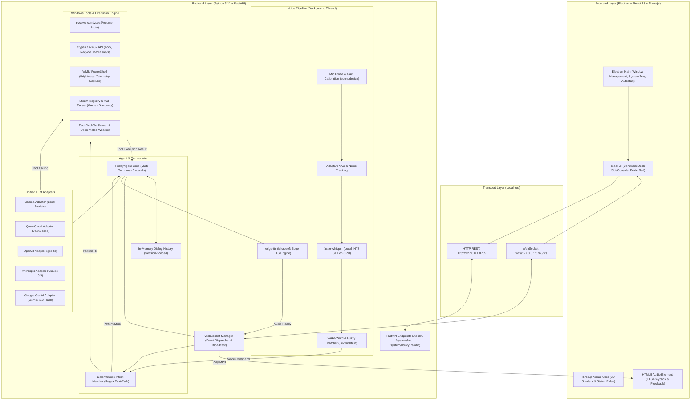

# FRIDAY — Desktop AI Assistant для Windows

**FRIDAY** — локальный desktop AI-ассистент для Windows с голосовым и текстовым интерфейсом, интеграцией системных инструментов операционной системы и поддержкой как локальных моделей (Ollama), так и внешних LLM-провайдеров (OpenAI, Anthropic, Google Gemini, QwenCloud).

Проект решает задачу создания персонального ассистента в стиле JARVIS/FRIDAY: управление окнами и программами, системная телеметрия, медиа-контроль, поиск информации и голосовое взаимодействие в режиме реального времени без привязки к единственному закрытому провайдеру.

---

## Overview

FRIDAY объединяет графический HUD-интерфейс на базе веб-технологий и Python-бэкенд, выполняющий низкоуровневые операции в операционной системе Windows.

### Ключевые возможности архитектуры
- **Гибридный LLM-бэкенд**: возможность работы полностью локально и бесплатно через Ollama (`qwen2.5:3b`) без передачи данных во внешние сети, либо подключение передовых облачных моделей (Gemini 2.0 Flash, Claude 3.5 Sonnet, GPT-4o, Qwen 3.7 Flash) через унифицированные стриминговые адаптеры.
- **Двухуровневое исполнение команд**:
  - *Детерминированный fast-path*: мгновенный матчинг регулярными выражениями для системных команд (громкость, яркость, блокировка, запуск приложений) с нулевой задержкой и без расхода токенов.
  - *LLM Tool Calling*: многошаговый цикл рассуждений модели с вызовом зарегистрированных функций для нетривиальных запросов.
- **Безопасность (Human-in-the-Loop)**: потенциально деструктивные действия (выключение ПК, перезагрузка, принудительное завершение процессов, очистка корзины) блокируются до явного подтверждения пользователем в UI.
- **Голосовой конвейер под Windows**: адаптивная калибровка входного уровня микрофона, энергетический VAD, локальный STT на базе `faster-whisper` (INT8 на CPU), распознавание имени-активатора («Пятница») и синтез речи через `edge-tts`.
- **Интеграция с рабочим окружением Windows**: управление громкостью через Windows Core Audio (pycaw), сканирование установленных игр в библиотеках Steam через реестр и VDF-манифесты, мониторинг железа через WMI/CIM и `psutil`.

---

## Screenshots / Demo

<!-- Для добавления демонстрации поместите файлы в директорию assets/ и раскомментируйте блок ниже:


-->

> **Примечание:** скриншоты интерфейса (HUD с 3D-ядром Three.js, панель телеметрии и каталог приложений) находятся в процессе подготовки релизных ассетов.

---

## Features

Все перечисленные ниже функции полностью реализованы в кодовой базе репозитория:

### Голосовой стек и аудио
- **Адаптивный выбор и калибровка микрофона** (`mic_probe.py`): автоматический перебор входных аудиоустройств по доступным API (WASAPI, MME, DirectSound, WDM-KS), замер уровня шума (RMS) и пиковых значений, автоматический расчет коэффициента входного усиления (`input_gain`).
- **Энергетический VAD (Voice Activity Detection)**: динамическое слежение за уровнем фонового шума (`_noise_ema`) и автоматическая подстройка порогов речи и тишины в реальном времени.
- **Фильтрация артефактов**: подавление аномальных всплесков сигнала WDM-KS (`_despike`), программный AGC (Automatic Gain Control) и ресемплинг в 16 кГц.
- **Локальное распознавание речи (STT)**: интеграция с `faster-whisper` (модели `tiny`, `base`, `small`, `medium`) с инференсом на CPU в формате `int8`.
- **Детекция ключевого слова (Wake Word)**: нечеткий поиск активатора («Пятница», «Friday» и фонетические вариации через расстояние Левенштейна $\le 2$). Поддержка режима «сессии» (18 секунд), позволяющего вести диалог без повторения активатора в каждой реплике.
- **Синтез речи (TTS)**: генерация аудио через Microsoft Edge TTS (`edge-tts`, русский голос `ru-RU-SvetlanaNeural` с ускорением +12%), защита от акустической обратной связи (`_is_echo`) и координация окончания воспроизведения с UI.

### Системные инструменты (PC Tools)
- **Управление приложениями и играми**:
  - Запуск софта по имени и псевдонимам (`open_app`, `APP_ALIASES`), открытие URI-схем `steam://` и веб-ссылок.
  - Сканирование библиотек Steam через реестр Windows (`Software\Valve\Steam`), парсинг `libraryfolders.vdf` и `appmanifest_*.acf` с выдачей списка установленных игр в боковую панель.
  - Детекция установленного софта разработчика (VS Code, Cursor, Blender, браузеры, Discord, Spotify).
  - Принудительное завершение процессов по имени (`close_app`) с защитой системных процессов Windows (`csrss.exe`, `lsass.exe`, `services.exe` и др.) и подтверждением в UI.
- **Файловая система и сеанс**:
  - Быстрое открытие стандартных папок Windows (Downloads, Documents, Desktop, Pictures, Music, Videos) или произвольных путей через Проводник (`open_folder`).
  - Мгновенная блокировка рабочей станции Windows (`lock_workstation` через Win32 `LockWorkStation`).
  - Очистка системной корзины (`empty_recycle` через Shell API `SHEmptyRecycleBinW`).
  - Создание скриншота первичного монитора средствами .NET/PowerShell с сохранением в `Pictures/FRIDAY/capture.png`.
  - Запись произвольного текста в буфер обмена Windows (`clipboard_set`).
- **Управление мультимедиа и питанием**:
  - Установка уровня громкости мастер-шины Windows 0–100% и отключение звука (`set_volume`, `set_mute` через COM-интерфейсы `IAudioEndpointVolume`).
  - Эмуляция мультимедийных клавиш клавиатуры (`media_key`: Play/Pause, Next, Previous, Stop через Win32 `keybd_event`).
  - Регулировка яркости экрана через WMI (`set_brightness` через `WmiMonitorBrightnessMethods`).
  - Управление питанием системы (`system_power`: shutdown, restart, sleep через Windows API и системные утилиты с подтверждением).
- **Информационные сервисы**:
  - Веб-поиск через DuckDuckGo (`web_search` на базе `duckduckgo_search`).
  - Получение текущей погоды без сторонних API-ключей через геокодинг и прогноз Open-Meteo (`get_weather`) с русскоязычной расшифровкой WMO-кодов.

### Клиентский интерфейс (Desktop UI)
- **3D-интерактивное ядро (Three.js)**: процедурная сфера с шейдером Вороного, динамической реакцией на состояние ассистента (`idle`, `listening`, `thinking`, `speaking`, `error`) и текстовым дублированием текущего ответа.
- **Мониторинг ресурсов (Live HUD)**: обновление метрик в реальном времени (нагрузка CPU %, потребление RAM в GB и %, трафик сети в KB/s, заряд батареи, имена оборудования из WMI/CIM).
- **Оповещения в углах экрана (Corner Panels)**: контекстные всплывающие слоты с отображением распознанного голоса, вызванных инструментов, ошибок и системных событий.
- **Интеграция с оболочкой Windows**: сворачивание в системный трей (Tray), управление автозапуском через ветку `HKCU\...\Run`, запуск в полноэкранном режиме без рамки (frameless HUD).

---

## Architecture

Взаимодействие компонентов организовано по клиент-серверной модели: легковесный фронтенд на Electron общается с локальным Python-сервисом по протоколам WebSocket и HTTP REST.



---

## How it works

Ниже приведен пошаговый пример обработки команды пользователя: от интерфейса до выполнения действия и голосового ответа.

```
[Пользователь] "Пятница, сделай звук на 30 и открой Steam"
      │
      ▼
1. Захват аудио: sounddevice считывает буфер, VAD фиксирует окончание фразы
      │
      ▼
2. Локальный STT: faster-whisper транскрибирует аудио в текст
      │
      ▼
3. Обработка активатора: пайплайн находит «Пятница», активирует окно сессии (18 с) 
   и передает чистую команду: "сделай звук на 30 и открой Steam"
      │
      ▼
4. Fast-Path проверка: регулярные выражения не находят одиночного точного паттерна 
   для составной команды -> запрос передается в FridayAgent
      │
      ▼
5. Запрос к LLM: формируется контекст (System Prompt + история + схема доступных Tools) 
   и отправляется в активный LLM-провайдер со стримингом
      │
      ▼
6. Исполнение Tools (Раунд 1):
   - Модель возвращает tool_call: set_volume(level=30)
   - Агент вызывает set_volume() через pycaw -> громкость Windows установлена на 30%
   - Результат "[Tool set_volume result]: Volume set to 30%." добавляется в историю диалога
   - Модель возвращает tool_call: open_app(name="steam")
   - Агент вызывает open_app() -> запущен процесс Steam
   - Результат "[Tool open_app result]: Opened steam." добавляется в историю диалога
      │
      ▼
7. Формирование ответа (Раунд 2):
   - Модель генерирует финальный лаконичный ответ: "Громкость установлена на тридцать процентов, Steam открыт."
   - Текстовые чанки через WebSocket стримятся в UI (отображаются в центре экрана)
      │
      ▼
8. Синтез и воспроизведение:
   - edge-tts генерирует временный MP3-файл
   - Сервер отправляет событие audio_ready на клиент
   - Фронтенд воспроизводит аудио через HTML5 Audio и шлет voice_playback_done
   - Агент возвращает статус в listening
```

---

## Tech Stack

| Слой | Технологии | Назначение в проекте |
|---|---|---|
| **Desktop Shell** | Electron 33, TypeScript | Управление системным окном без рамки, системный трей, автозапуск, фоновое поддержание процессов |
| **Frontend UI** | React 18, Vite 5, Vanilla CSS | Компонентный интерфейс, отображение HUD, консоль телеметрии, каталог установленных приложений, оверлеи подтверждений |
| **3D Graphics** | Three.js 0.185 | Процедурное анимированное 3D-ядро, кастомные шейдеры материала (Voronoi), световые эффекты статуса |
| **Backend Core** | Python 3.11+, FastAPI 0.115, Uvicorn 0.32 | Асинхронный сервер, WebSocket-шина сообщений, REST эндпоинты статики и телеметрии |
| **STT (Speech-to-Text)** | faster-whisper 1.0 (CTranslate2) | Локальное распознавание русской речи на CPU с квантованием INT8 |
| **TTS (Text-to-Speech)** | edge-tts 6.1 | Синтез естественной русской речи через облачный сервис Microsoft Edge TTS |
| **Audio I/O** | sounddevice 0.5, numpy 1.26 | Захват входного аудиопотока, зондирование микрофонов, программный AGC, VAD |
| **Windows Automation** | pycaw, comtypes, ctypes, psutil, WMI, PowerShell | Управление громкостью через Core Audio, системные вызовы Win32, мониторинг процессов и метрик железа |
| **Внешние API & Поиск** | duckduckgo-search 6.3, httpx 0.27 | Анонимный веб-поиск и получение погодных данных Open-Meteo |
| **LLM SDKs** | openai 1.54, anthropic 0.39, google-genai 1.0 | Унифицированные клиенты для Ollama/Qwen/OpenAI, Claude и Gemini |

---

## Project Structure

```
friday/
├── apps/
│   ├── backend/                      # Python FastAPI бэкенд
│   │   ├── agent/
│   │   │   └── friday.py             # FridayAgent: цикл оркестрации и вызова инструментов
│   │   ├── llm/                      # Адаптеры к языковым моделям
│   │   │   ├── provider.py           # Базовый интерфейс LLMProvider и фабрика
│   │   │   ├── openai_provider.py    # OpenAI, Ollama и QwenCloud адаптер
│   │   │   ├── anthropic_provider.py # Anthropic Claude адаптер
│   │   │   └── google_provider.py    # Google Gemini (google-genai) адаптер
│   │   ├── tools/                    # Инструменты автоматизации Windows
│   │   │   ├── registry.py           # Реестр схем Tools и диспетчер выполнения
│   │   │   ├── system.py             # Запуск программ, псевдонимы, громкость, питание
│   │   │   ├── desktop.py            # Яркость, скриншоты, процессы, корзина, медиа-клавиши
│   │   │   ├── hud.py                # Телеметрия железа (CIM/WMI, psutil)
│   │   │   ├── library.py            # Парсинг библиотек Steam и установленного софта
│   │   │   └── weather.py            # Клиент погоды Open-Meteo
│   │   ├── voice/                    # Голосовой конвейер
│   │   │   ├── pipeline.py           # VoicePipeline: VAD, wake-word, STT, TTS
│   │   │   ├── mic_probe.py          # Диагностика и автоматическая калибровка микрофонов
│   │   │   └── intents.py            # Fast-path классификатор детерминированных команд
│   │   ├── config.py                 # Pydantic-конфигурация (.env и %APPDATA%/FRIDAY/config.json)
│   │   ├── main.py                   # Точка входа FastAPI, WebSocket роутер, HTTP эндпоинты
│   │   └── requirements.txt          # Python-зависимости бэкенда
│   └── desktop/                      # Клиентское приложение Electron + React
│       ├── electron/
│       │   ├── main.ts               # Главный процесс Electron, трей, IPC
│       │   └── preload.ts            # Безопасный контекстный мост (contextBridge)
│       ├── src/
│       │   ├── components/           # React UI: CommandDock, FolderRail, SideConsole и др.
│       │   ├── hooks/                # useFridayWS (WebSocket шина), useHudStats (телеметрия)
│       │   ├── scene/
│       │   │   └── fridayWorld.ts    # 3D-сцена Three.js с процедурными шейдерами
│       │   ├── App.tsx               # Корневой лейаут приложения
│       │   └── index.css             # Стили оформления HUD
│       └── package.json              # Зависимости и скрипты фронтенда
├── packages/
│   └── shared/
│       └── protocol.ts               # Общие TypeScript-типы протокола WebSocket
├── scripts/                          # PowerShell-скрипты управления окружением
│   ├── start-friday.ps1              # Запуск полного стека приложения в фоне
│   ├── stop-friday.ps1               # Корректная остановка всех процессов
│   ├── run-backend.ps1               # Запуск бэкенда отдельно
│   ├── free-port.ps1                 # Очистка занятого порта 8765
│   └── install-autostart.ps1         # Регистрация / удаление из автозагрузки Windows
├── .env.example                      # Шаблон конфигурации переменных окружения
├── HOW_IT_WORKS.md                   # Подробное руководство по внутреннему устройству
└── package.json                      # Корневой манифест проекта и скрипты запуска
```

---

## Getting Started

### Системные требования
- **ОС**: Windows 10 или Windows 11 (64-bit).
- **Node.js**: версия 18.x или выше.
- **Python**: версия 3.11 или выше.
- **Микрофон**: встроенный или внешний (для голосового режима; текстовый режим доступен без микрофона).
- *(Опционально)* **Ollama**: установленная локально для бесплатного инференса без API-ключей.

### 1. Клонирование и установка зависимостей

Откройте PowerShell в папке проекта:

```powershell
# Установка зависимостей десктопа и Python-пакетов бэкенда одной командой:
npm run install:all
```

Или вручную:

```powershell
# Зависимости фронтенда:
npm install --prefix apps/desktop

# Зависимости Python бэкенда:
python -m pip install -r apps/backend/requirements.txt
```

### 2. Настройка переменных окружения

Скопируйте шаблон `.env.example` в `.env`:

```powershell
copy .env.example .env
```

Отредактируйте `.env` в зависимости от выбранного провайдера:

```env
# Выбор провайдера: ollama | qwen | openai | anthropic | google
LLM_PROVIDER=ollama
LLM_MODEL=qwen2.5:3b
LLM_BASE_URL=http://127.0.0.1:11434/v1

# Секретные ключи (заполняются для выбранного облачного провайдера):
QWEN_API_KEY=
OPENAI_API_KEY=
ANTHROPIC_API_KEY=
GOOGLE_API_KEY=

# Настройки голосового конвейера:
WAKE_WORD_ENABLED=true
WAKE_WORD=пятница
TTS_VOICE=ru-RU-SvetlanaNeural
STT_MODEL=tiny

# Параметры запуска:
AUTOSTART=true
SPLASH_DURATION_MS=2500
BACKEND_HOST=127.0.0.1
BACKEND_PORT=8765
```

> **Важно:** ключи API хранятся исключительно в файле `.env` (который добавлен в `.gitignore`) и никогда не передаются на клиентский интерфейс и не сохраняются в открытый файл настроек пользователя.

### 3. Быстрый запуск (Вариант по умолчанию)

Для одновременного запуска Ollama (если установлена), бэкенда и Electron-приложения:

```powershell
npm run dev
```

Для остановки всех связанных фоновых процессов:

```powershell
npm run stop
```

Если порт `8765` оказался занят предыдущим процессом:

```powershell
npm run free-port
```

### 4. Режим разработки с выводом логов (Рекомендуется для отладки)

Для просмотра подробных логов распознавания речи, трансляции WebSocket и ответов LLM запустите процессы в двух отдельных терминалах:

**Терминал 1 (Бэкенд):**
```powershell
cd apps/backend
python main.py
```
*Убедитесь, что появился вывод:* `Uvicorn running on http://127.0.0.1:8765`.

**Терминал 2 (Клиент Electron + Vite):**
```powershell
cd apps/desktop
npm run electron:dev
```

### 5. Сборка дистрибутива (.exe)

Сборка production-установщика Windows через `electron-builder`:

```powershell
cd apps/desktop
npm run electron:build
```
Готовый инсталлятор будет сформирован в директории `apps/desktop/release/`.

### 6. Управление автозапуском Windows

Включение запуска при старте системы:
```powershell
npm run autostart:install
```

Отключение автозапуска:
```powershell
npm run autostart:remove
```

---

## Agent & Tool Architecture

В проекте реализована **собственная легковесная архитектура агента** без использования тяжелых фреймворков (LangChain, AutoGen, CrewAI), что обеспечивает прозрачность управления состоянием и минимальные накладные расходы по памяти.

### 1. Управление контекстом и историей
- Оркестратор `FridayAgent` (`apps/backend/agent/friday.py`) хранит историю сообщений текущей сессии в оперативной памяти (`self.history`).
- Перед каждым обращением к LLM в начало контекста динамически подставляется компактный `SYSTEM_PROMPT`. Он задает персонаж (Пятница, женский род, лаконичный тон без повторных приветствий, ответы строго в 1–2 предложениях на русском языке).
- Сессионная история может быть сброшена методом `reset()`.

### 2. Двухуровневая маршрутизация: Fast-Path vs LLM Loop
При поступлении сообщения (голосом или из чата) система проверяет два пути исполнения:
1. **Детерминированный Fast-Path (`voice/intents.py`)**:
   - Набор регулярных выражений проверяет типичные короткие команды: управление громкостью, яркостью, медиа-плеером, блокировкой экрана, созданием скриншота, выключением ассистента или ПК.
   - Если совпадение найдено, инструмент вызывается мгновенно без обращения к языковой модели. Это критически важно при использовании локальных небольших моделей (например, `qwen2.5:3b`), которые могут нестабильно генерировать JSON-структуры схем вызовов.
2. **Многошаговый цикл агента (`FridayAgent.run`)**:
   - Если команда нестандартная или требует рассуждений, управление передается в агент.
   - Агент запускает стриминг с передачей списка деклараций `TOOL_DEFINITIONS`.
   - Поддерживается до **5 последовательных раундов вызова инструментов** (`MAX_TOOL_ROUNDS = 5`).
   - Если модель возвращает `tool_call`, агент парсит аргументы, выполняет функцию, оборачивает результат в системное сообщение вида `[Tool {name} result]: {result}` и инициирует следующий раунд генерации, позволяя модели сформулировать человекопонятный ответ на базе полученных данных.

### 3. Адаптеры моделей и нормализация схем функций
Интерфейс `LLMProvider` нормализует форматы стриминга ответов и вызовов инструментов между провайдерами:
- **OpenAI / Qwen / Ollama**: потоковый парсинг дельт аргументов функций (`choice.delta.tool_calls`) через единый SDK `openai`.
- **Anthropic**: трансляция JSON Schema в специфичный формат `input_schema` для Claude с потоковой обработкой блоков `tool_use`.
- **Google Gemini**: работа через официальный SDK нового поколения `google-genai`. Поскольку валидатор схем Gemini отклоняет ряд ключевых слов стандартного JSON Schema (например, `minimum`, `maximum`), в `google_provider.py` реализована автоматическая очистка параметров (`_sanitize_gemini_schema`).

### 4. Human-in-the-Loop (Подтверждение деструктивных действий)
Операции, способные прервать работу пользователя или привести к потере данных, защищены протоколом подтверждения:
- Инструменты из множества `CONFIRM_TOOLS = {"system_power", "close_app", "empty_recycle"}` не выполняются мгновенно.
- Генерируется уникальный `action_id` (UUID), а параметры операции сохраняются в словаре `PENDING_CONFIRMATIONS`.
- На клиент отправляется WebSocket-сообщение `confirm_request`.
- В интерфейсе появляется модальное окно с описанием действия и кнопками **CONFIRM** и **ABORT**.
- При клике пользователя клиент отправляет `confirm_action`, сервер исполняет команду либо отменяет её, после чего озвучивает результат.

---

## Limitations / Roadmap

### Текущие технические ограничения
- **Привязка к платформе Windows**: проект глубоко завязан на системные API Windows (Win32 API, Windows Core Audio через COM, реестр, WMI/CIM, PowerShell). Кроссплатформенность для Linux/macOS не предусмотрена архитектурой текущего MVP.
- **Сессионная память**: история диалога хранится исключительно в памяти процесса Python и сбрасывается при перезапуске приложения. Векторные базы данных (RAG) и постоянная долговременная память пока не подключены.
- **Инструменты в Ollama**: локальные легковесные модели (3B–7B) часто ошибаются в синтаксисе Tool Calling. Для стабильности в связке с Ollama используется текстовый режим в сочетании с детерминированным fast-path. Для комплексного многошагового вызова инструментов рекомендуются облачные модели (Gemini, Claude, GPT-4o, Qwen-Max).
- **Wake Word на базе постобработки STT**: в текущей версии детекция активатора выполняется после записи аудиофрагмента через Whisper и нечеткое сопоставление строк, а не через сверхлегкую DSP-нейросеть потокового прослушивания в фоне.

### План развития (Roadmap)
- [ ] Переход на сверхлегкий потоковый движок детекции ключевых слов (openWakeWord / Porcupine) с минимальной утилизацией CPU в режиме ожидания.
- [ ] Локальная долговременная память на базе SQLite и векторных эмбеддингов для сохранения пользовательских фактов и предпочтений.
- [ ] Поддержка стандарта **Model Context Protocol (MCP)** для подключения внешних серверов инструментов и интеграций без расширения монолитного реестра.
- [ ] Анализ контекста экрана (Vision / Screen Understanding) через мультимодальные модели (Gemini 2.0 / GPT-4o).
- [ ] Расширение библиотеки локальных навыков: управление мультимониторными конфигурациями, аудиоплеерами (Spotify Web API) и умным домом.

---

## Troubleshooting

| Проблема | Причина | Решение |
|---|---|---|
| **Ошибка API Key при отправке сообщения** | Не задан ключ в `.env` для выбранного провайдера | Проверьте файл `.env` в корне проекта; убедитесь, что имя переменной соответствует провайдеру (`GOOGLE_API_KEY`, `OPENAI_API_KEY` и т.д.), и перезапустите бэкенд. |
| **Порт 8765 занят (`WinError 10048`)** | Предыдущий процесс Python остался в памяти | Выполните `npm run free-port` или `npm run stop`, затем перезапустите проект. |
| **Интерфейс не подключается к бэкенду** | Бэкенд еще не успел инициализироваться или завершился с ошибкой | Запустите бэкенд вручную в отдельном терминале (`cd apps/backend && python main.py`) и изучите стек ошибки. |
| **Whisper долго обрабатывает голос** | Выбрана тяжелая модель для распознавания на слабом CPU | В настройках (шестеренка в Command Dock) переключите `STT Model` на `tiny`. |
| **Микрофон не реагирует на голос** | Выбрано не то аудиоустройство или шум превышает порог | Откройте эндпоинт `http://127.0.0.1:8765/voice/diag` в браузере, проверьте выбранный микрофон и метрику `probeRms`. Для тестирования голосового тракта без микрофона отправьте запрос на `POST /voice/selftest`. |
| **Ошибки подключения к Ollama** | Служба Ollama не запущена | Запустите Ollama, выполните команду `ollama pull qwen2.5:3b` и перезапустите FRIDAY. |

---

## License

Проект распространяется под лицензией [MIT](LICENSE).
